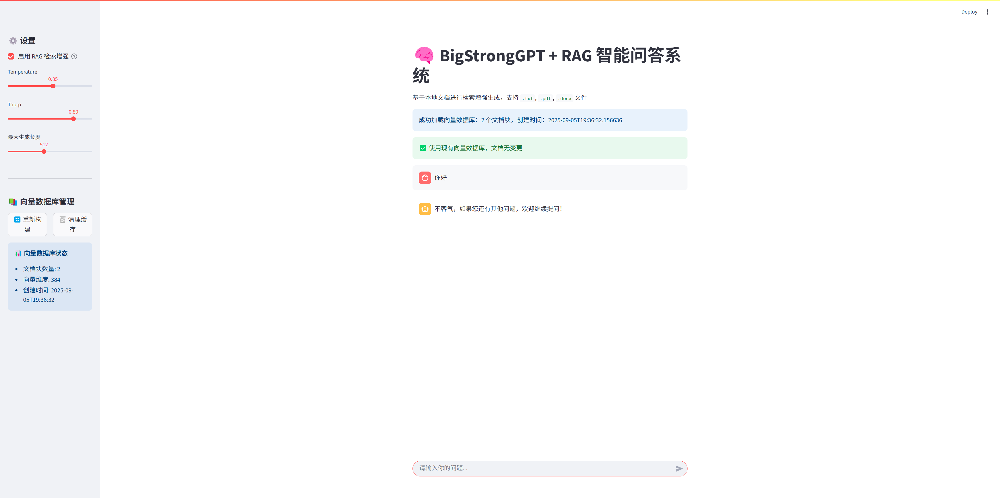

# BigStrongGPT

基于Transformer的Decoder-Only架构的中文大语言模型项目，支持预训练、全参数微调、LoRA微调以及RAG检索增强生成，总参数量 25.830 百万。

## 🚀 项目特性

- **完整的训练流程**：从预训练到微调的完整pipeline
- **多种训练方式**：支持预训练、全参数SFT、LoRA微调
- **RAG增强**：集成检索增强生成，支持本地文档问答
- **Web界面**：基于Streamlit的友好交互界面
- **实验跟踪**：集成SwanLab进行训练过程监控

## 📁 项目结构

```
BigStrongGPT/
├── model/                    # 模型相关文件
│   ├── model_big_strong.py   # 主模型架构
│   ├── model_lora.py         # LoRA微调实现
│   ├── tokenizer.json        # 分词器配置
│   └── *.pth                 # 预训练模型权重
├── dataset/                  # 数据集
│   ├── lm_dataset.py         # 数据集处理类
│   ├── pretrain_hq.jsonl     # 预训练数据
│   ├── sft_*.jsonl          # 微调数据
│   └── lora_*.jsonl         # LoRA微调数据
├── train/                    # 训练脚本
│   ├── train_pretrain.py     # 预训练脚本
│   ├── train_full_sft.py     # 全参数微调脚本
│   └── train_lora.py         # LoRA微调脚本
├── scripts/                  # 工具脚本
│   ├── web_demo.py          # Web演示界面
│   └── train_tokenizer.py   # 分词器训练
├── output/                   # 训练输出
│   ├── pretrain_output/      # 预训练输出
│   ├── sft_output/          # 微调输出
│   └── lora_output/         # LoRA输出
├── doc/                      # 文档存储（用于RAG）
├── vector_db/               # 向量数据库（RAG）
└── unused/                  # 未使用的实验代码
```

## 💰训练成本

使用RTX5090训练, AutoDL平台租用成本为3.24 RMB/h，总计训练成本小于10RMB。

### pretrain训练

预训练数据集1.6GB，训练时长45min。

### sft训练

数据集1.2GB，训练时长1h20min。

### lora微调

数据集33MB， 训练时长10min。

## 🛠️ 环境配置

### 依赖安装

```bash
pip install torch torchvision torchaudio --index-url https://download.pytorch.org/whl/cu128 # 下载GPU版本
pip install transformers
pip install streamlit
pip install sentence-transformers
pip install faiss-cpu  # 或 faiss-gpu
pip install swanlab
pip install PyMuPDF  # PDF处理
pip install python-docx  # Word文档处理
```

## 🎯 使用方法

### 1. 预训练

```bash
cd train
python train_pretrain.py --data_path ../dataset/pretrain_hq.jsonl --epochs 1 --batch_size 32
```

### 2. 全参数微调

```bash
cd train
python train_full_sft.py --data_path ../dataset/sft_mini_512.jsonl --epochs 2 --batch_size 16
```

### 3. LoRA微调

```bash
cd train
python train_lora.py --data_path ../dataset/lora_medical.jsonl --epochs 10 --batch_size 32
```

### 4. Web演示

```bash
cd scripts
streamlit run web_demo.py
```

## 🧠 模型架构

### BigStrongConfig

- **模型类型**: MiniMind架构
- **隐藏层维度**: 512
- **层数**: 8层
- **注意力头数**: 8
- **词汇表大小**: 6400
- **最大位置编码**: 32768
- **激活函数**: SiLU
- **归一化**: RMSNorm

### 关键特性

- **RoPE位置编码**: 支持长序列
- **Flash Attention**: 高效注意力计算
- **KV Cache**: 推理加速
- **LoRA支持**: 参数高效微调

## 📊 数据集格式

### 预训练数据 (pretrain_hq.jsonl)
```json
{"text": "<|im_start|>鉴别一组中文文章的风格和特点，例如官方、口语、文言等。需要提供样例文章才能准确鉴别不同的风格和特点。<|im_end|> <|im_start|>好的，现在帮我查一下今天的天气怎么样?今天的天气依据地区而异。请问你需要我帮你查询哪个地区的天气呢？<|im_end|> <|im_start|>打开闹钟功能，定一个明天早上七点的闹钟。好的，我已经帮您打开闹钟功能，闹钟将在明天早上七点准时响起。<|im_end|> <|im_start|>为以下场景写一句话描述：一个孤独的老人坐在公园长椅上看着远处。一位孤独的老人坐在公园长椅上凝视远方。<|im_end|> <|im_start|>非常感谢你的回答。请告诉我，这些数据是关于什么主题的？这些数据是关于不同年龄段的男女人口比例分布的。<|im_end|> <|im_start|>帮我想一个有趣的标题。这个挺有趣的：\"如何成为一名成功的魔术师\" 调皮的标题往往会吸引读者的注意力。<|im_end|> <|im_start|>回答一个问题，地球的半径是多少？地球的平均半径约为6371公里，这是地球自赤道到两极的距离的平均值。<|im_end|> <|im_start|>识别文本中的语气，并将其分类为喜悦、悲伤、惊异等。\n文本：“今天是我的生日！”这个文本的语气是喜悦。<|im_end|>"}

```

### 微调数据 (sft_*.jsonl)
```json
{"conversations": [{"role": "user", "content": "请告诉我在中国古代的“四大发明”是什么？"}, {"role": "assistant", "content": "中国古代的“四大发明”是指造纸术、印刷术、火药和指南针。这四项发明对世界文明的发展产生了深远的影响：\n\n1. **造纸术**：据史书记载，东汉时期的蔡伦改进了造纸工艺，使得纸张的生产更加便捷、成本更低，质量也更加优良。这一发明极大地促进了文化的传播和保存。\n\n2. **印刷术**：中国古代的印刷术最早可以追溯到唐代的雕版印刷，到了宋代发展出了活字印刷技术。印刷术的发明极大地促进了知识的传播，降低了书籍的成本，对教育和文化的发展起到了重要的推动作用。\n\n3. **火药**：火药最初是在唐代被发现的，最初可能用于医疗或炼金术。到了宋代，人们开始将火药用于军事目的，发明了各种火器。火药的发明改变了战争的面貌，对世界军事技术的发展产生了重大影响。\n\n4. **指南针**：指南针最初在中国被用于风水测量，后来逐渐发展成为航海导航的重要工具。这一发明极大地促进了海上航行技术的发展，对于新航路的开辟和世界地理大发现起到了关键作用。\n\n这四项发明不仅在中国历史上占有重要地位，而且对全世界的科技进步和文明发展都产生了深远的影响。"}]}

```

### LoRA数据 (lora_*.jsonl)
```json
{"conversations": [{"role": "user", "content": "头发稀少细软可以植发吗"}, {"role": "assistant", "content": "是的，头发稀少和细软的情况下，植发是一种可能的解决方案。植发手术是一种将头发从头部的一个地方移植到另一个地方的过程，通常用于治疗男性或女性的脱发。这种手术通常由皮肤科医生进行。\n\n植发手术的两种主要类型是：毛囊单位移植（FUT）和毛囊单位提取（FUE）。在FUT中，医生会从后脑勺切下一块头皮，然后将其分成数百个小部分，每个部分包含一个或几个毛囊，然后将这些毛囊植入秃头区域。在FUE中，医生会直接从头皮上提取毛囊，然后将它们植入秃头区域。\n\n然而，植发手术并不适合所有人。理想的候选人应该有足够的健康毛囊可以移植。此外，患者应该有适当的期望，因为植发手术可能需要多次手术，并且结果可能需要一年或更长时间才能显现。\n\n在决定是否进行植发手术之前，建议您咨询医生或植发专家，以了解这是否是最佳的解决方案。他们可以帮助您了解手术的风险和益处，以及可能的替代方案，如药物治疗或使用假发。"}]}

```

## 🔧 配置参数

### 训练参数

| 参数 | 预训练 | 全参数微调 | LoRA微调 |
|------|--------|------------|----------|
| 学习率 | 5e-4 | 5e-7 | 1e-4 |
| 批次大小 | 32 | 16 | 32 |
| 训练轮数 | 1 | 2 | 10 |
| 梯度累积 | 8 | 1 | 1 |

### 模型参数

- `hidden_size`: 隐藏层维度 (默认: 512)
- `num_hidden_layers`: 层数 (默认: 8)
- `max_seq_len`: 最大序列长度 (默认: 512)
- `vocab_size`: 词汇表大小 (默认: 6400)

## 🌐 RAG功能

### 支持的文档格式
- `.txt` - 纯文本文件
- `.pdf` - PDF文档
- `.docx` - Word文档

### 向量数据库
- 使用 `all-MiniLM-L6-v2` 作为embedding模型
- FAISS作为向量索引
- 支持文档变更检测和自动重建

### 使用方法
1. 将文档放入 `doc/` 目录
2. 启动Web界面
3. 系统会自动构建向量数据库
4. 启用RAG模式进行问答

## 📈 实验跟踪

项目集成了SwanLab进行训练过程监控：

- 实时loss和learning rate记录
- 训练进度可视化
- 超参数管理
- 实验对比

## 🚀 快速开始

1. **克隆项目**
```bash
git clone https://github.com/hh996/BigStrongGPT.git
cd BigStrongGPT
```

2. **安装依赖**
```bash
pip install -r requirements.txt
```

3. **准备数据**
将训练数据放入 `dataset/` 目录

4. **开始训练**
```bash
# 预训练
python train/train_pretrain.py

# 微调
python train/train_full_sft.py

# LoRA微调
python train/train_lora.py
```

5. **启动Web界面**
```bash
# Windows PowerShell
cd BigStrongGPT\scripts
$env:PYTHONPATH = (Get-Item ..).FullName
streamlit run web_demo.py
```

## 🎉效果展示

